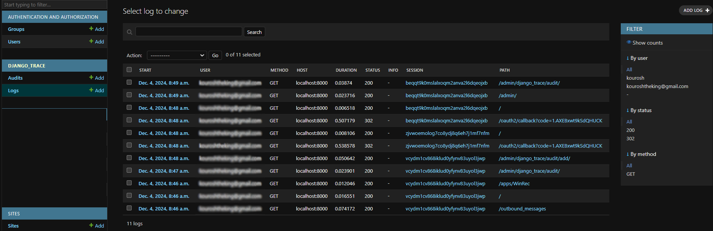
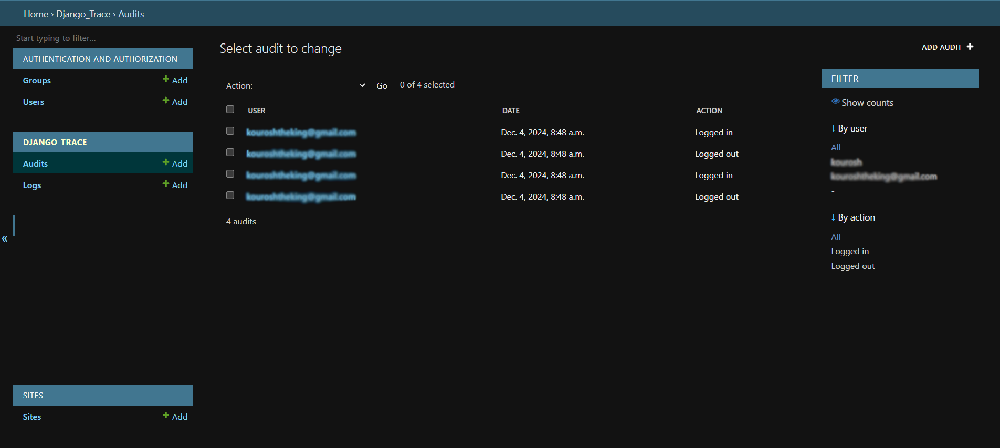
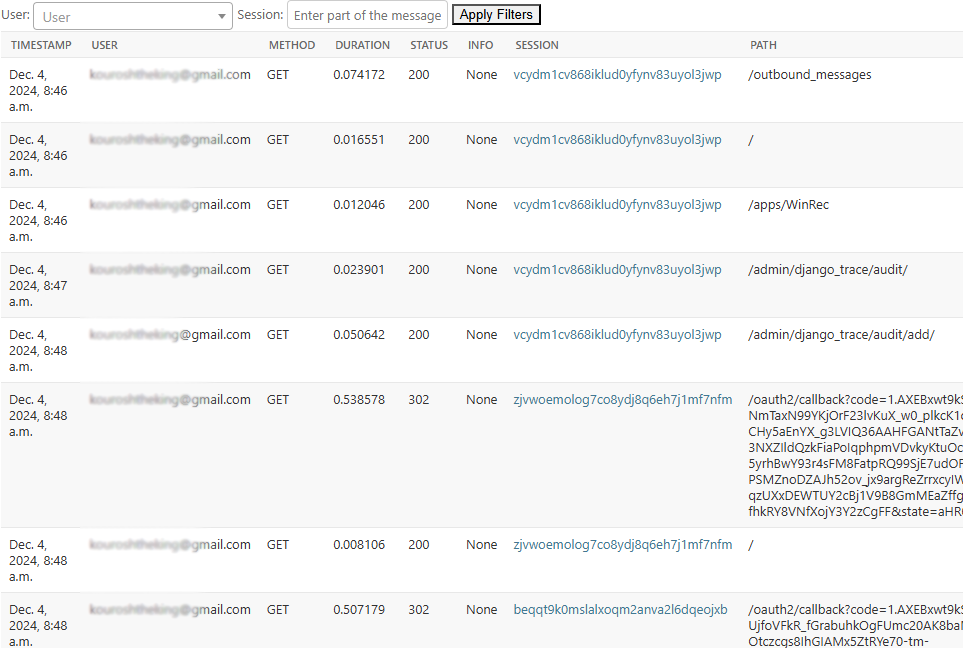
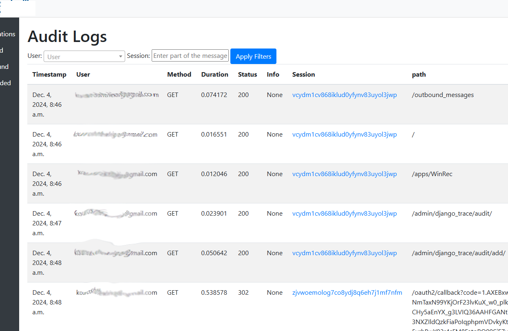

django_trace
==========

`django_trace` is a django add-on app that can be used to monitor your web app and your server resources and create audit reports for login/out activities and page visit logs.
Each of these operations can be disabled and they are all secure.

## How to install:

`pip install django_trace`

**Configuration:**
- In your `settings.py`, under `INSTALLED_APPS`, add 'django_trace'
- Add 'django_trace.middleware.MonitorMiddleware' to your `MIDDLEWARE_CLASSES` (for django<1.10) or `MIDDLEWARE` (for django >= 1.10)_inside your `settings.py`
- Migrate using these commands
```bash
python manage.py makemigrations django_trace
python manage.py migrate
```
- Optionally if you want to send notifications on resource issues, you can configure the options for django_trace by adding the configuration section shown below to your settings.py:

```python
EMAIL_BACKEND = 'django.core.mail.backends.smtp.EmailBackend'
EMAIL_HOST = 'smtp.gmail.com'
EMAIL_HOST_USER = 'noreply@mycompany.com'
EMAIL_HOST_PASSWORD = ''
EMAIL_PORT = 587
EMAIL_USE_TLS = True

DJANGO_TRACE = {
    "WARNING_EMAILS": ["me@mycompany.com"],
    "MEMORY_THRESHOLD": 85,
    "DISK_THRESHOLD": 85,
    "PATH_FILTER": [],
    "MAX_LOG_COUNT": 10000,
    "ONLY_TRACE_LOGGED_IN_USERS": True
    }
```

By default, `ONLY_TRACE_LOGGED_IN_USERS` is `True` which means only web requests for logged in users will be recorded.

If there are urls that you do not wish to monitor, you can exclude them using a list of regex in `PATH_FILTER` in the configuration section shown above.

By default, the system keeps 10000 records in the logs which can be modified by adjusting MAX_LOG_COUNT.

**Sending alerts when resources are running low:**

`WARNING_EMAILS` can be used to inform you when your server is running low on memory or disk usage. In order to use that, you put the emails of the people whom need to be informed in the `WARNING_EMAILS` list.

`MEMORY_THRESHOLD` and `DISK_THRESHOLD` have a 85% default but you can adjust them.

## How to check resources on a schedule
You can add the following command to your cronjob:
```bash
python manage.py check_resources
```
to check the state of your server periodically.
There is a quiet period set to 1 day so if one of the resources is running low and an email is sent, the check will abort within the next day to prevent sending too many emails. If you want to change the quiet period from the default 1 day, you can use the option `QUIET_TIME_MINUTES` within DJANGO_TRACE.

Also, the host name is automatically determined to be included in the email. If you want to overwrite it, use the `HOST` option.

## How use the audit
After installing, and configuring `django_trace`, make sure you migrate the database as previously explained.

Then, you'll get admin pages created for the audit.

To see **who is logged in or out** of the system, see the admin page at `/admin/django_trace/audit`.

To see all the ** web activities**, see the admin page at `/admin/django_trace/log`

Below are sample images of that:




Moreover, you can add custom views for the audit as explained below.

## Making A Custom Audit Page
To make a custom audit page,
- Run `python manage.py collectstatic` to ensure static files are fetched.
- Modify your `urls.py` file as below:

```python
from django.urls import path, include

urlpatterns = [
    path('audit/', include('django_trace.urls')),
]
```

- Make sure you have `django_trace` as well as `dal` and `dal_select2` in your `INSTALLED_APPS` as below:

```python
INSTALLED_APPS = [
    'myapp',
    'django.contrib.admin',
    'django.contrib.auth',
    'django.contrib.contenttypes',
    'django.contrib.sessions',
    'django.contrib.messages',
    'django.contrib.staticfiles',
    'dal',
    'dal_select2',
    'django_trace',
]
```

This will produce a view at `/audit`. It can be viewed by logged in users.
Note that if you have created a `base.html` in your template folder, django_trace will use your template automatically so that you can display customized top header or side bar.

However, if you do not have it, django_trace will stil generate a usable view as shown below:






If you have any questions or request, please feel free to contact the author or post it on github.

